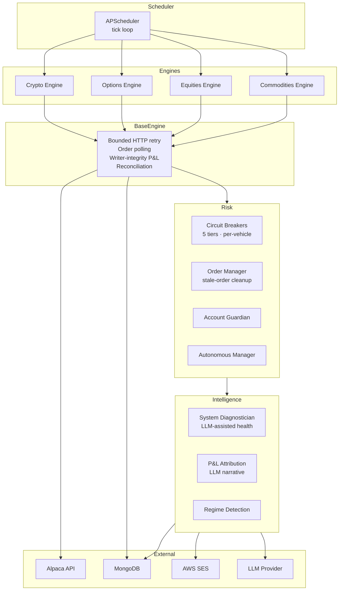

# Architecture Notes

This document expands on the high-level diagram in `README.md`. It is descriptive, not prescriptive — concrete thresholds, weights, and rules are left to the reader.

## Module Map

## Scheduler Jobs (Public Cadence Only)

| Job | Cadence | Purpose |
|-----|---------|---------|
| `heartbeat` | every minute | proof-of-life to MongoDB |
| `account_health_check` | every few minutes | broker-side sanity |
| `portfolio_snapshot` | every few minutes | equity/cash time series |
| `order_cleanup` | sub-hourly | cancel orphaned orders |
| `self_healing_check` | sub-hourly | restart degraded subsystems |
| `system_diagnostics` | bi-hourly | LLM-assisted health summary |
| `pnl_attribution` | daily | end-of-day narrative + email |
| `*_trading` (per vehicle) | hourly while market open | strategy step |

Exact intervals are configurable and **deliberately omitted** here.

## Risk Layer

**Circuit breakers** are organized in tiers; each tier is configured per vehicle with global defaults:

| Tier | Trigger (concept) | Action |
|------|-------------------|--------|
| 1 | Consecutive losses ≥ N | Cooldown for X hours |
| 2 | Daily drawdown ≥ % | Halt new entries today |
| 3 | Weekly drawdown ≥ % | Scale size down for the week |
| 4 | Monthly drawdown ≥ % | Manual review gate |
| 5 | Total drawdown ≥ % | Emergency stop, optionally close all |

Threshold values are deliberately not in this repo.

**Writer-integrity guard**: when an order returns `poll_timeout`, `rejected`, or any non-fill terminal state, `to_dict()` coerces `pnl` and `pnl_pct` to `null` *before* persistence. This prevents phantom P&L from corrupting historical metrics. After-hours `poll_timeout` events are logged at INFO, not WARNING, to avoid noise.

**Reconciliation**: at the top of every engine cycle, positions are re-read from the broker. Local `self.positions` is treated as a cache and discarded on conflict. This is the single most important pattern for surviving restarts mid-session.

## Intelligence Layer

Two LLM-mediated services are exposed:

1. **System Diagnostician** — every ~2 hours, gathers metrics (engine state, error patterns, execution gaps, staleness, P&L anomalies) and asks an LLM to classify health and surface 1–3 plain-language observations. Output is `healthy | degraded | unhealthy` + issue list.
2. **P&L Attribution** — daily, asks an LLM (with grounded position-level data + market context) to produce a "why did it move" narrative. Output is persisted to MongoDB and emailed via SES.

Both services are **defensive**: if the LLM call fails or rate-limits, the system continues without them.

## What's Intentionally Missing

If you're reading this hoping to copy-paste a working strategy, you will be disappointed. The following are *deliberately* excluded:

- Signal generators and their hyperparameters
- Allocation percentages per vehicle
- Symbol universes
- Sector / correlation caps
- Stop-loss / take-profit ladders
- Specific entry windows or timing rules
- All MongoDB collection schemas beyond high-level names

Those are *your* alpha and *your* risk tolerance. This repo gives you the **scaffolding**; the conviction is yours.

## AI-Driven Development Loop

The actual dev process that produced this system:

1. **Goal stated** (often a one-sentence Slack ping)
2. **Plan drafted** by orchestrator; reviewed by human
3. **Dispatch** to specialist subagents (security, DB, full-stack, QA) in parallel where independent
4. **Verification gate** before any claim of completion — tests pass, logs clean, diff scanned
5. **Memory updated** so the next session starts where this one ended

This loop is more important than any single component in the architecture. It is what makes one engineer + Claude Code produce work that would otherwise take a team.
